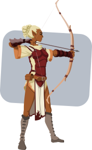

# <p align="center"> MIDGARD : El juego de mesa </p>
#### Un juego de mesa competitivo inspirado en la cultura Vikinga y la mitología Nordica
###### Por: Joan Lopez (jslopezr00@gmail.com)
###### Jugadores: 2 - 4 | Tiempo: 60 min
###### Licencia: Creative Commons  
## 0. ÍNDICE  

**1.** Résumen del juego  
**2.** Tablero  
**3.** Reglas y Glosario  
**4.** Piezas   
  * **4.1** Piezas Básicas  
  * **4.2** Piezas Especiales  
  * **4.3** Piezas Míticas   
  * **4.4** Jarls

**5.** Cartas de Fuerza de Batalla  
**6.** Configuración inicial del tablero
**7.** Fases del turno   
**7.** Recursos  

### 1. RESUMEN DEL JUEGO   
El principal objetivo en Midgard es derrotar al Jarl(Regente) que comanda el ejercito de tu contrincante. Se podría deinir la escencia del juego con las siguientes preguntas:

- **¿Que tipo de juego es Midgard?**  
  Midgard es un juego de tipo competitivo cuyo principal objetivo es derrotar al Jarl enemigo diezmando su ejercito (en princípio).  
- **¿Que historia cuenta el juego?**  
  Midgar se inspira en el ajedréz para la base de enfrentamiento entre dos ejercitos Vikingos, pero utiliza elementos de la mitolgía Nordica y de aspectos militares historicos de la epoca Vikinga (siglos IX,X,XII).
- **¿Para cuantas personas está diseñado?**  
  Inicialmente está diseñado para dos (2) personas, pero si se extiende el tamaño del tablero pueden jugar hasta cuatro(4) personas.  
- **Cuales son sus principales mecánicas?**  
  Usa fundalmente elementos de azar por medio del lanzamiento de **dados de 4, 6, y 20 lados** respectivamente. Adicionalmente el tablero basado en piezas hexagonales permite simular un campo de batalla y la utilización de elementos propios de juegos de cartas coleccionables, así como elementos de
  juegos de rol.  

### 2. TABLERO   

#### 2.1 Disposición (para 3 jugadores)  
  

#### 2.2 Tipos de lozas
  - ***Charcos***: Aplica ***desventaja*** a todas las tiradas realizadas por cualquier pieza mientras permanezca en esta loza.  

  - ***Praderas***: No aplica ningúna regla.

  - ***Tierras***: Aplica ***ventaja*** a todas las tiradas realizadas por cualquier pieza mientras permanezca en esta loza.  

#### 2.3 Distribución de lozas
| 2 Jugadores  | 3 Jugadores  | 4 Jugadores  |
|---|---|---|
| 20 Charchos  | 28 Charcos  | 38 Charcos   |
| 60 Praderas  | 85 Praderas  | 112 Praderas  |
| 11 Tierras  | 14 Tierras  | 19 Tierras  |
| **Total: 91**  | **Total: 127**  | **Total: 169**  |


### 3. REGLAS y GLORARIO
#### 3.1 Definiciones
- ***Pieza:***  
  Ficha que representa a una (1) unidad de batalla (Jarl, Guerrero, etc)  
- ***Loza:***  
  Pieza **hexagonal** que representa un (1) espacio en el terreno de juego (tablero)  
- ***Tirada:***  
  También conocida como ***lanzamiento***, se refiere al acto de lanzar un dado.
- ***Modificadores:***  
  Son los valores unitarios (ej: +2,+3,+5) que se le adicionan al resultado de una **tirada o lanzamiento**.
- ***Clase de dificultad (CD):***   
  Se refiere al numero objetivo que se debe **igualar o superar** en una **tirada**.  
  Por ejemplo, una expresión del tipo ```CD16``` indica que en el resultado de una **tirada (sumando los modificadores correspondientes)** debe ser igual o superior a **16**.  

- ***1d20:***  
  Abreviatura para referirse a un dado de **20 caras**.  

- ***1d4:***  
  Abreviatura para referirse a un dado de **4 caras**.  

- ***1d6:***  
  Abreviatura para referirse a un dado de **6 caras**. (***los de toda la vida***)
- ***Ventaja:***  
  Consiste en lanzar **2d20** y tomar como resultado el ***mayor*** valor entre ambos

- ***Desventaja:***  
  Consiste en lanzar **2d20** y tomar como resultado el ***menor*** valor entre ambos

#### 3.2 Características

| Característica  |   Simbolo   | Descripción  | Ejemplo  |
|:---:|:---:|:---:|:---:|
| Armadura  |   | Valor de la **CD** a superar con una tirada de un dado **1d20**  |  |
|  Bonificador de Ataque |   |  **Bonificador** que se debe sumar al resultado de la tirada de **1d20** | |
| Movimiento  |   | Cantidad de lozas que se puede mover la pieza por turno | |
| Alcance  |   | Cantidad **máxima** de lozas que puede alcanzar un ataque de dicha pieza  | |
| Puntos de sacrificio  |   | Valor unitario que sirve para conseguir **Cartas** de ***Fueza de Batalla*** o ***Favores de los Dioses***  | |

#### 3.3 ACCIONES  

  - **Atacar:**    
    1. Determinar si en la loza actual se aplica **ventaja** o **desventaja**, caso en el cual se deben lanzar **2d20** y escoger el valor mayor o menor según sea el caso.
    2. **Lanzar 1d20**
    3. Al valor del lanzamiento del paso anterior sumar los bonificadores de ataque correspondientes.

  - **Ataques combinados:(Solo contra unidades Míticas)**   
    Si 2 o más piezas están adyacentes a una misma pieza Mítica se pueden sumar los resultados de las tiradas de ataque con sus bonificadores correspondientes.

  - **Realizar sacrificios:**  
    Canjear las piezas enemigas capturadas por su valor total de **Puntos de Sacrificio** con el objetivo de obtener **Cartas** de ***Fueza de Batalla*** o ***Favores de los Dioses***.

### 4. PIEZAS  
##### **4.1 Piezas Básicas**  
<!-------------------------------- GUERRERO-------------------------------------->
  <table>
  <tr><th> GUERRERO </th><th> VALORES</th></tr>
  <tr><td>

  

  </td><td>

  |   Característica| Valor                                        |
  |:-----------------:|:------------------------------------------:|
  |   | **12**       |
  |    | **+3**       |
  |   | **1**        |
  |  | **1**        |
  |   | **1**  |
  </td></tr> </table>
<!-------------------------------- ARQUERO -------------------------------------->
  <table>
  <tr><th> ARQUERO </th><th> VALORES</th></tr>
  <tr><td>

  

  </td><td>

  |   Característica| Valor                                        |
  |:-----------------:|:------------------------------------------:|
  |   | **10**       |
  |    | **+2**       |
  |   | **1**        |
  |  | **6**        |
  |   | **1**  |
  </td></tr> </table>

<!-------------------------------- lANCERO -------------------------------------->
  <table>
  <tr><th> LANCERO </th><th> VALORES</th></tr>
  <tr><td>

  

  </td><td>

  |   Característica| Valor                                        |
  |:-----------------:|:------------------------------------------:|
  |   | **9**        |
  |    | **+4**       |
  |   | **1**        |
  |  | **2**        |
  |   | **1**  |
  </td></tr> </table>

##### **4.2 Piezas Especiales**   
<!-------------------------------- BERSEKER -------------------------------------->
<table>
<tr><th> BERSEKER </th><th> VALORES</th></tr>
<tr><td>


</td><td>

|   Característica| Valor                                        |
|:-----------------:|:------------------------------------------:|
|   | **15**       |
|    | **+5**       |
|   | **2**        |
|  | **1**        |
|   | **2**  |
</td></tr> </table>
<!-------------------------------- VALKIRIAS -------------------------------------->
<table>
<tr><th> VALKIRIA </th><th> VALORES</th></tr>
<tr><td>


</td><td>

|   Característica| Valor                                        |
|:-----------------:|:------------------------------------------:|
|   | **15**       |
|    | **+6**       |
|   | **1**        |
|  | **1**        |
|   | **2**  |
</td></tr> </table>
<!-------------------------------- JINETES DE PONY -------------------------------------->
<table>
<tr><th> JINETE DE PONY </th><th> VALORES</th></tr>
<tr><td>


</td><td>

|   Característica| Valor                                        |
|:-----------------:|:------------------------------------------:|
|   | **14**       |
|    | **+4**       |
|   | **5**        |
|  | **1**        |
|   | **2**  |
</td></tr> </table>

##### **4.3 Piezas Míticas**  
| Nombre  | Descripción  | Efecto |
|:-:|---|---|
| Fenrir  | Lobo Gigante |Daño x +area|
| Jörmundgander   | Serpiente Gigante|Veneno X área|
| Ymir  | Gigante de hielo |Daño x +area|
| Fafnir | Dragón de fuego  |Daño x +area|
| NidHogg  | Dragón devorador de cuerpos |Multiplica puntos de sacrificio|
| Auðumbla  | Vaca Gigante  |Bonificadores de armadura X +área|
| Gullinbursti  |Cerdo Gigante   |Montura para el Jarl|
| Sigurd  | Héroe Mitológico  | Bonificadores de ataque X area|

##### **4.4 JARLS**  

###### Principales Características:
Un o una Jarl, son las piezas más importantes en Midgard, puesto que:
  - **Posee un contador de vidas:****. Cuando este llega a cero (0),   el/ la Jarl muere.**   
  - **Al morir un Jarl, se pierde el juego**.   
  - **Es la única pieza capaz de invocar criaturas Míticas**.   
  - **Se pueden usar las habilidades de Jarl cada turno**.

###### Atacar a un/una Jarl:
Para atacar a un/una Jarl, las piezas atacantes deben superar en una tirada de ataque la defensa del Jarl ```(CD15)```, si se supera dicha tirada, se procede a lanzar el **dado de daño (1d4)** y el resultado de dicho lanzamiento **se debe restar al contador de vidas correspondiente.**  
##  
***Descripción de uso de una carta de Jarl***  
  
##  

**A continuación se describen la anatomía de una carta de Jarl y como se usan:**  

**1.** ***Dado de daño***: Indica el dado (1d4 en este ejemplo) que se debe lanzar una vez superada una tirada de ataque que afecta al Jarl que está siendo atacado/a.  

**2.** ***Armadura:*** Valor de la **CD**(15 en este ejemplo) a superar con una tirada de **1d20**.  

**3.** Indicadores de ***movimiento,bonificador de ataque y alcance*** que aplican para dicho/a Jarl.  

**4.** ***+2*** Significa "Incrementa el contador de vidas en 2 unidades, si **una vez por turno** se supera una tirada de 1d20 con ```CD15```".  

**5.** ***-2*** Significa "Decrementa el contador de vidas en 2 unidades, y todas las unidades adyacentes al/la Jarl recibiran un **bonificador de +2** en sus tiradas de ataque **durante este turno**".  

**6.** ***-8*** Significa "Decrementa el contador de vidas en 8 unidades, y podrás invocar al campo de batalla (desde la loza de arranque) una criatura Mítica escogida al azar de la baraja correspondiente".   

**7.** Valor inicial del contador de vidas del/la Jarl.  

### 5. CARTAS DE APOYO
Dichas cartas se obtienen intercambiando puntos de sacrificio  por carta según la siguiente regla:

  **[ X 3]** : Obtienes una Carta de Fuerza de Batalla del mazo correspondiente.

  **[ X 8]** : Obtienes un lanzamiento de **2d6** en la tabla de ***Favores de los dioses***.

#### 5.1 Fuerzas de Batalla  

| Cantidad por Mazo | Nombre  | Efecto  |
|:-:|---|---|
|  2 | Valkiria  | Pieza especial  |
|  2 | Jinete de Pony  | Pieza especial  |
|  2 | Berseker  | Pieza especial  |
|  2 | Impulso de batalla  | +1d20 x 1 turno  |
|  2 | Grito de terror  | -1d20 a un oponente x 1 turno  |
|  2 | Vigor  | Tu Jarl gana [  + 3 ] |
|  1 | Maldición de las runas  | Un Jarl enemigo pierde [  - 3 ]  |
|  2 | Ayuda de los aldeanos locales | Ganas  [  X 3 ] |
|  2 | Ayuda del sepulturero  | Un oponente pierde [  X 3 ]  |
|  2 | Escudo Nuevo  | Tu Jarl gana [  + 3 ] permanentemente |
|  2 | Arma Nueva  | Tu Jarl gana [  + 2 ] permanentemente |  

#### 5.1 Favores de los Dioses    
| **Resultado de lanzar 2d6** | **Favor obtenido**  |
|   :-:   |     ---             |
|2|Tu Jarl obtiene [  + 5 ] únicamente por este turno|
|3|Tus oponentes obtienen [  - 3 ] en todas sus piezas por este turno |
|4|Recuperas tus **Guerreros** abatidos por tus oponentes|
|5|Ganas **3 nuevos Lanceros**|
|6|Ganas **3 nuevos Guerreros**|
|7|Tu petición a los dioses es ignorada (no ganas ningún beneficio)|
|8|Ganas **3 nuevos Arqueros**|
|9|Recuperas tus **Lanceros o Arqueros** abatidos por tus oponentes|
|10|Obtienes **un bonificador de +5** en todas tus tiradas este turno|
|11|Tus oponentes **tienen desventaja** en todas sus tiradas el siguiente turno (la desventaja no es acumulable)|
|12|Ganas **2 unidades especiales a tu elección**|  

### 6. CONFIGURACIÓN INICIAL DEL TABLERO

- Distribución inicial de piezas por cada jugador/ra:  

  | **Pieza** | **Cantidad inicial**  |
  |   :-:     |     ---               |
  |Jarl |1|  
  |Guerrero |10|  
  |Arquero |5|  
  |Lancero |5|

- Disposición de las piezas iniciales en el tablero:  


### 7. FASES DEL TURNO  

  **1. Fase de Sacrificios**  
  Lorem ipsum dolor sit amet, consectetur adipisicing elit, sed do eiusmod tempor incididunt ut labore et dolore magna aliqua. Ut enim ad minim veniam, quis nostrud exercitation ullamco laboris nisi ut aliquip ex ea commodo consequat. Duis aute irure dolor in reprehenderit in voluptate velit esse cillum dolore eu fugiat nulla pariatur. Excepteur sint occaecat cupidatat non proident, sunt in culpa qui officia deserunt mollit anim id est laborum.

  **2. Fase de Movimiento**  
  Lorem ipsum dolor sit amet, consectetur adipisicing elit, sed do eiusmod tempor incididunt ut labore et dolore magna aliqua. Ut enim ad minim veniam, quis nostrud exercitation ullamco laboris nisi ut aliquip ex ea commodo consequat. Duis aute irure dolor in reprehenderit in voluptate velit esse cillum dolore eu fugiat nulla pariatur. Excepteur sint occaecat cupidatat non proident, sunt in culpa qui officia deserunt mollit anim id est laborum.

  **3. Fase de Ataque**  
  Lorem ipsum dolor sit amet, consectetur adipisicing elit, sed do eiusmod tempor incididunt ut labore et dolore magna aliqua. Ut enim ad minim veniam, quis nostrud exercitation ullamco laboris nisi ut aliquip ex ea commodo consequat. Duis aute irure dolor in reprehenderit in voluptate velit esse cillum dolore eu fugiat nulla pariatur. Excepteur sint occaecat cupidatat non proident, sunt in culpa qui officia deserunt mollit anim id est laborum.

  **4. Final del turno**  
  Lorem ipsum dolor sit amet, consectetur adipisicing elit, sed do eiusmod tempor incididunt ut labore et dolore magna aliqua. Ut enim ad minim veniam, quis nostrud exercitation ullamco laboris nisi ut aliquip ex ea commodo consequat. Duis aute irure dolor in reprehenderit in voluptate velit esse cillum dolore eu fugiat nulla pariatur. Excepteur sint occaecat cupidatat non proident, sunt in culpa qui officia deserunt mollit anim id est laborum.

### 8. OPEN GAME LICENSE  

##### OPEN GAME LICENSE Version 1.0a

The following text is the property of Wizards of the Coast, Inc. and is Copyright 2000 Wizards of the Coast, Inc ("Wizards"). All Rights Reserved.

1. Definitions: (a)"Contributors" means the copyright and/or trademark owners who have contributed Open Game Content; (b)"Derivative Material" means copyrighted material including derivative works and translations (including into other computer languages), potation, modification, correction, addition, extension, upgrade, improvement, compilation, abridgment or other form in which an existing work may be recast, transformed or adapted; (c) "Distribute" means to reproduce, license, rent, lease, sell, broadcast, publicly display, transmit or otherwise distribute; (d)"Open Game Content" means the game mechanic and includes the methods, procedures, processes and routines to the extent such content does not embody the Product Identity and is an enhancement over the prior art and any additional content clearly identified as Open Game Content by the Contributor, and means any work covered by this License, including translations and derivative works under copyright law, but specifically excludes Product Identity. (e) "Product Identity" means product and product line names, logos and identifying marks including trade dress; artifacts; creatures characters; stories, storylines, plots, thematic elements, dialogue, incidents, language, artwork, symbols, designs, depictions, likenesses, formats, poses, concepts, themes and graphic, photographic and other visual or audio representations; names and descriptions of characters, spells, enchantments, personalities, teams, personas, likenesses and special abilities; places, locations, environments, creatures, equipment, magical or supernatural abilities or effects, logos, symbols, or graphic designs; and any other trademark or registered trademark clearly identified as Product identity by the owner of the Product Identity, and which specifically excludes the Open Game Content; (f) "Trademark" means the logos, names, mark, sign, motto, designs that are used by a Contributor to identify itself or its products or the associated products contributed to the Open Game License by the Contributor (g) "Use", "Used" or "Using" means to use, Distribute, copy, edit, format, modify, translate and otherwise create Derivative Material of Open Game Content. (h) "You" or "Your" means the licensee in terms of this agreement.

2. The License: This License applies to any Open Game Content that contains a notice indicating that the Open Game Content may only be Used under and in terms of this License. You must affix such a notice to any Open Game Content that you Use. No terms may be added to or subtracted from this License except as described by the License itself. No other terms or conditions may be applied to any Open Game Content distributed using this License.

3. Offer and Acceptance: By Using the Open Game Content You indicate Your acceptance of the terms of this License.

4. Grant and Consideration: In consideration for agreeing to use this License, the Contributors grant You a perpetual, worldwide, royalty-free, non-exclusive license with the exact terms of this License to Use, the Open Game Content.

5. Representation of Authority to Contribute: If You are contributing original material as Open Game Content, You represent that Your Contributions are Your original creation and/or You have sufficient rights to grant the rights conveyed by this License.

6. Notice of License Copyright: You must update the COPYRIGHT NOTICE portion of this License to include the exact text of the COPYRIGHT NOTICE of any Open Game Content You are copying, modifying or distributing, and You must add the title, the copyright date, and the copyright holder's name to the COPYRIGHT NOTICE of any original Open Game Content you Distribute.

7. Use of Product Identity: You agree not to Use any Product Identity, including as an indication as to compatibility, except as expressly licensed in another, independent Agreement with the owner of each element of that Product Identity. You agree not to indicate compatibility or co-adaptability with any Trademark or Registered Trademark in conjunction with a work containing Open Game Content except as expressly licensed in another, independent Agreement with the owner of such Trademark or Registered Trademark. The use of any Product Identity in Open Game Content does not constitute a challenge to the ownership of that Product Identity. The owner of any Product Identity used in Open Game Content shall retain all rights, title and interest in and to that Product Identity.

8. Identification: If you distribute Open Game Content You must clearly indicate which portions of the work that you are distributing are Open Game Content.

9. Updating the License: Wizards or its designated Agents may publish updated versions of this License. You may use any authorized version of this License to copy, modify and distribute any Open Game Content originally distributed under any version of this License.

10. Copy of this License: You MUST include a copy of this License with every copy of the Open Game Content You Distribute.

11. Use of Contributor Credits: You may not market or advertise the Open Game Content using the name of any Contributor unless You have written permission from the Contributor to do so.

12. Inability to Comply: If it is impossible for You to comply with any of the terms of this License with respect to some or all of the Open Game Content due to statute, judicial order, or governmental regulation then You may not Use any Open Game Material so affected.

13. Termination: This License will terminate automatically if You fail to comply with all terms herein and fail to cure such breach within 30 days of becoming aware of the breach. All sublicenses shall survive the termination of this License.

14. Reformation: If any provision of this License is held to be unenforceable, such provision shall be reformed only to the extent necessary to make it enforceable.

15. COPYRIGHT NOTICE
Open Game License v 1.0 Copyright 2000, Wizards of the Coast, Inc.
